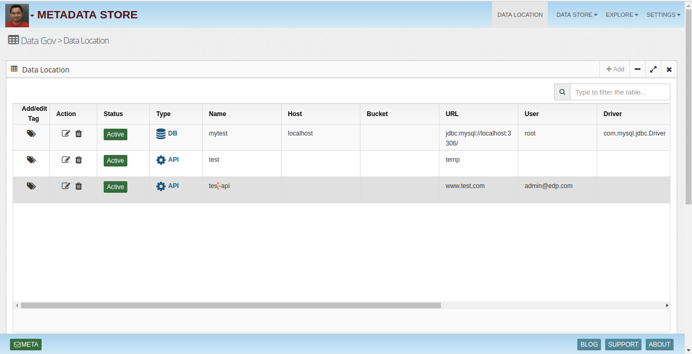
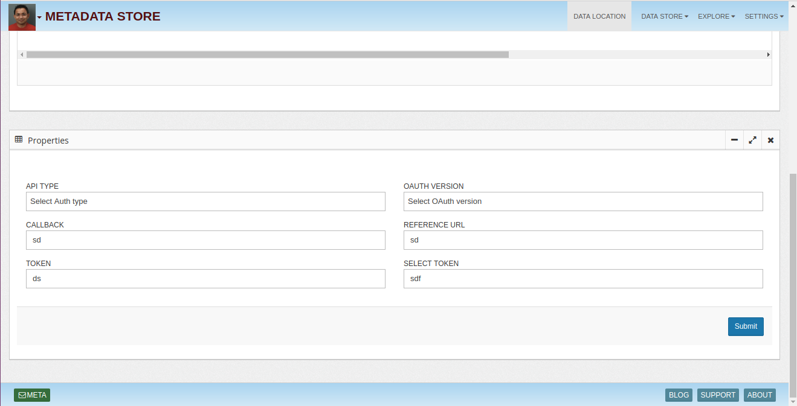
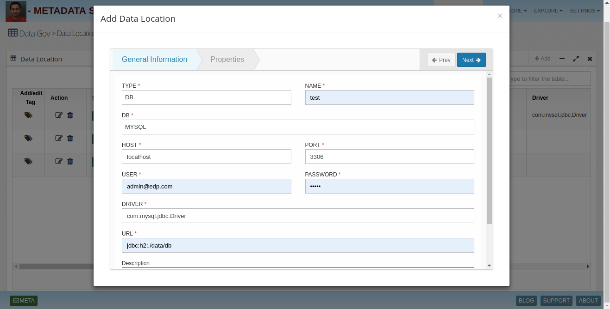
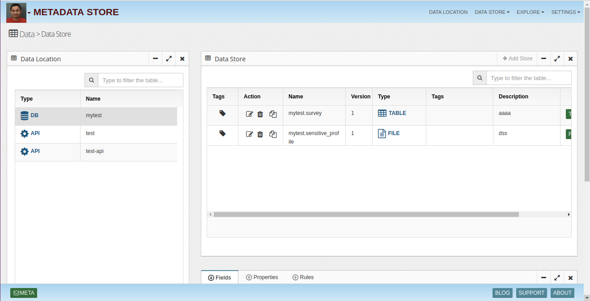
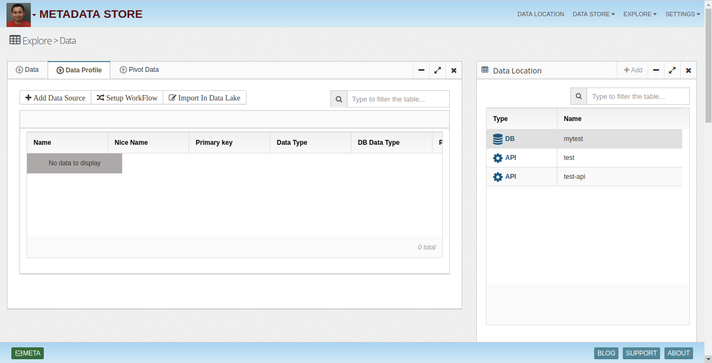
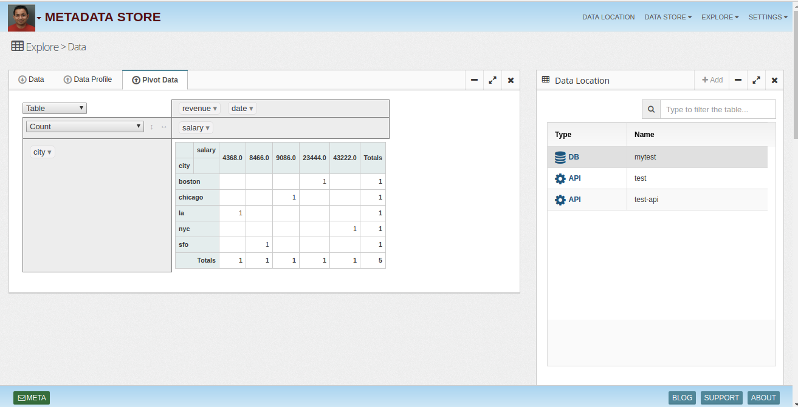
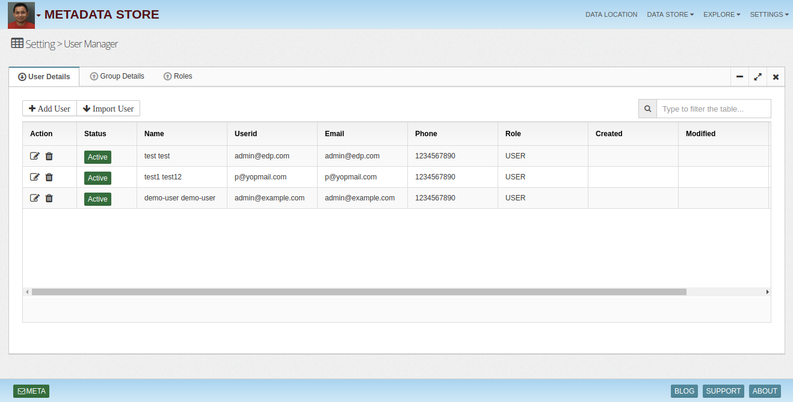
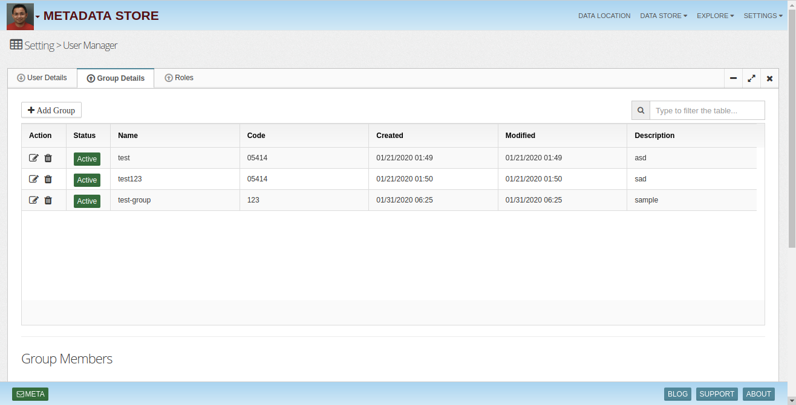

# Metadata - Manage metadata of data assets

Metadata is information describing about any other data. For example, if a database table includes the field Employee Name, database metadata will include data type of this field, maximum number of characters allowed in this field, or any other information on this field. Similarly, a document metadata includes information such as author, date created, date modified, and file size.

Metadata Management ensures that metadata is added appropriately and that the information can be accessed, analyzed, shared, and maintained across the organization.

Consider the following while managing metadata:

Must be stored where it can be easily accessible and indexed.
Must be of consistent quality.
Must be persistent.
Must be available for reuse.

## Best Practices of Metadata Management
Following are few best practices of Metadata Management:

Forming a Metadata Administration Team. Metadata Administration team will be involved in creating metadata strategies, refining and implementing metadata standards, choosing metadata tools, and implementing metadata management.
Creating a Metadata Strategy. A Metadata Strategy explains the value and context of information included in the information system of the organization. Retrieve information such as the type of data required for the business, from where this data can be retrieved, methods to maintain the metadata, the types of metadata required, and standards (for example, ISO) to be followed. This information helps to form the Metadata Strategy and helps in implementing metadata management.
Maintaining Metadata Standards. Evaluate a set of standards applicable to the organization, and maintain the standards.
Selecting Metadata Tools. Select the right set of tools to create and manage metadata.

## Insight Lake Metadata Hub
InsightLake Metadata Hub enables companies to obtain metadata from various data sources like databases, files, real time streams etc and store them for easy exploration and integration with other applications. 

Metadata Hub defines metadata layer on various data entities. 

System - represents data sources like databases, file systems etc.
Data Location - represents database, file systems, Kafka broker, SOLR hosts etc. 
Data Store - represents table, Kafka topic, file etc. 
Data Field - represents column, data element, field etc. 
Application - represents data application. 
Domain - represents data's business domain' 
User - represents data user. 
Metadata hub captures technical, operational and business domain metadata and stores them at central location for easy exploration.

## Technical Metadata
Table schema, File type, format, AVRO JSON schema, tags are some of the technical information elements about data assets which Metadata Hub captures and stores.

Data profiling feature allows extraction of known technical metadata like data field type, size, min and max values, sample values etc. It also extracts derived information like geo, currency, business domain types etc. All types of metadata gets stored in SOLR based central store to allow fast exploration and REST based integration with other enterprise applications.

## Operational Metadata
Metadata hub captures operational metadata from running jobs like number of records ingested, time duration, status etc.

## Tags & Properties
Any data element can be tagged for example a table or cell can be tagged as secure, which can then be used by security policy manager to automatically secure the access to the table or cell. Ingestion flow can be tokenized with tags, which can flow through end to end data pipeline for better lineage tracking. Other than tagging, properties (name, value) can be defined on data elements. For example on credit card column a property "Masking" with value "last 4" can be defined and used in business rules where ever data gets processed.

## Metadata at cell level
Metadata hub allows companies to create metadata at various levels like data source, data location, store, field and cell. Company can provision tags and properties at these levels and access them in various data pipelines or applications.

## Business Glossary
Metadata hub enables companies to put business context over technical metadata to provide clear business terms on top of physical data. It also increases the productivity of the enterprise. Generated glossary helps cross functional alignment between various business groups and provides a common business vocabulary across organization.

## Easy exploration & integration
Metadata hub stores metadata in SOLR based central storage. It provides fast metadata search and exploration capability. SOLR also exposes metadata store as REST apis, which applications can use to access metadata.

## Data Location

* Locations

* Properties

* Add Location

## Data Store

* Stores

* Add Store

## Data Explore

* Data

* Data Profile

* Pivot Table

## Users & Groups

* User Details

* Group Details

To learn more, check out [http://www.insightlake.com/metadata-store.html](http://www.insightlake.com/metadata-store.html)

Installation
------
* Download or clone the repository. 
* Run bin/insightlake command.
* Open browser with URL as http://localhost:8080/
* Change configuration in /conf folder to set different ports
* By default H2 database is used, you can change the database details in jdbc.properties file

Installation using docker 
------
* Download or clone the repository. 
* cd /docker
* Run `docker-compose -f docker-compose.yaml up --build`
* Open browser with URL as http://localhost:8080/
* While creating Data Location use below credentials  

        * username : root
        * password : password
        * URL :  jdbc:mysql://mysql:3306/

License
------
InsightLake Meta Data is a commercial product but distributed to be used freely. Please contact contact@insightlake.com for details.

Getting Help
----------

You can get help easily :
Community - Google Groups
Slack Channel
Twitter
Facebook
Email: contact@insightlake.com
